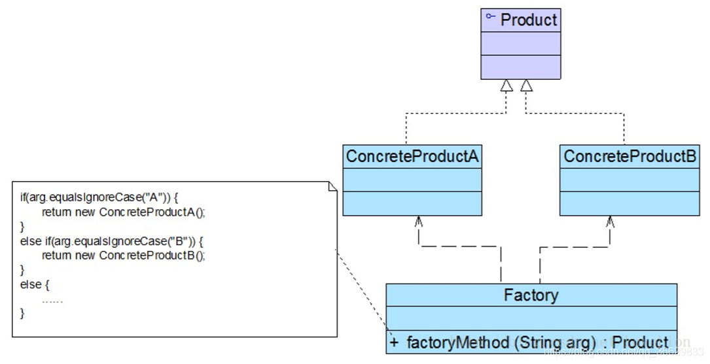
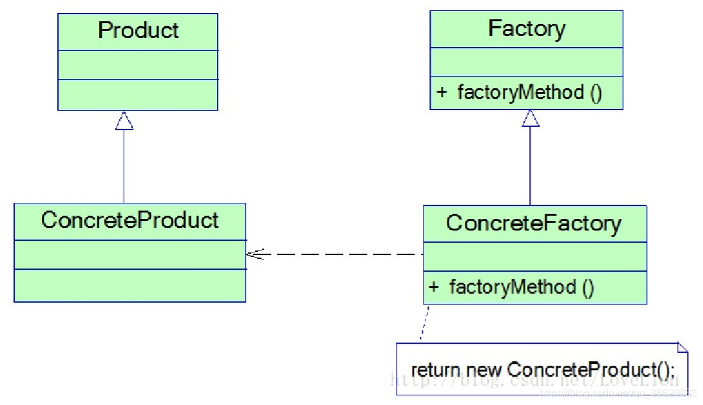
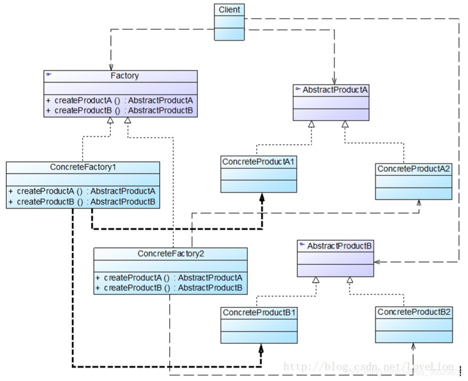

# [工厂模型](./DesignPatterns/src/main/java/com/mydesign/Factory)


## [简单工厂](./DesignPatterns/src/main/java/com/mydesign/Factory/SimpleFactory)
定义一个工厂类，它可以根据参数的不同返回不同类的 实例，被创建的实例通常都具有共同的父类。因为在简单工厂模式中用于创建实例的方法是静态(static)方法，因此简单工厂模式又被称为静态工厂方法模式，它属于类创建型模式。



在简单工厂模式结构图中包含如下几个角色：

- Factory（工厂角色）：工厂角色即工厂类，它是简单工厂模式的核心，负责实现创建所有产品实例的内部逻辑；工厂类可以被外界直接调用，创建所需的产品对象；在工厂类中提供了静态的工厂方法factoryMethod()，它的返回类型为抽象产品类型Product。
- Product（抽象产品角色）：它是工厂类所创建的所有对象的父类，封装了各种产品对象的公有方法，它的引入将提高系统的灵活性，使得在工厂类中只需定义一个通用的工厂方法，因为所有创建的具体产品对象都是其子类对象。
- ConcreteProduct（具体产品角色）：它是简单工厂模式的创建目标，所有被创建的对象都充当这个角色的某个具体类的实例。每一个具体产品角色都继承了抽象产品角色，需要实现在抽象产品中声明的抽象方法。

主要优点：
- 工厂类包含必要的判断逻辑，可以决定在什么时候创建哪一个产品类的实例，客户端可以免除直接创建产品对象的职责，而仅仅“消费”产品，简单工厂模式实现了对象创建和使用的分离。
- 客户端无须知道所创建的具体产品类的类名，只需要知道具体产品类所对应的参数即可。
- 通过引入配置文件，可以在不修改任何客户端代码的情况下更换和增加新的具体产品类，在一定程度上提高了系统的灵活性。

主要缺点：
- 由于工厂类集中了所有产品的创建逻辑，职责过重，一旦不能正常工作，整个系统都要受到影响。
- 使用简单工厂模式势必会增加系统中类的个数（引入了新的工厂类），增加了系统的复杂 度和理解难度。
- 系统扩展困难，一旦添加新产品就不得不修改工厂逻辑，在产品类型较多时，有可能造成 工厂逻辑过于复杂，不利于系统的扩展和维护。
- 简单工厂模式由于使用了静态工厂方法，造成工厂角色无法形成基于继承的等级结构。

适用场景
- 工厂类负责创建的对象比较少，由于创建的对象较少，不会造成工厂方法中的业务逻辑太过复杂。
- 客户端只知道传入工厂类的参数，对于如何创建对象并不关心。

### 简单工厂和策略模式的区别
简单工厂模式和策略模式在结构模式上两者很相似，所以我们经常会混淆它们。这里就先说一说我对它们的理解。

简单工厂模式：客户端传一个条件进工厂类，工厂类根据条件生成相应的对象并返回给客户端。

策略模式：客户端创建一个Context对象a,创建策略对象并当做参数传递给a,然后客户端使用a方法通过某种方法得到想要的值返回给客户端。

下面说一说它们的差异性：
- 它们的用途不一样。简单工厂模式是创建型模式，它的作用是创建对象。策略模式是行为型模式，作用是在许多行为中选择一种行为，关注的是行为的多样性。
- 解决的问题不同。简单工厂模式是解决资源的统一分发，将对象的创立同客户端分离开来。策略模式是为了解决策略的切换和扩展。
- 工厂相当于黑盒子，策略相当于白盒子。

如果在适合用策略模式的情况下用简单工厂模式，如果新增加策略就要修改工厂类，而这个可能会导致其他错误和比较繁琐，而如果使用了策略模式，只要将新增加的策略当做参数传递到Context类中即可。

## [工厂方法](./DesignPatterns/src/main/java/com/mydesign/Factory/FactoryMethod)
定义一个用于创建对象的接口，让子类决定将哪一个类实例化。工厂方法模式让一个类的实例化延迟到其子类。工厂方法模式又简称为工厂模式，又可称作虚拟构造器模式或多态工厂模式。工厂方法模式是一种类创建型模式。



工厂方法模式角色:
- Product（抽象产品）：它是定义产品的接口，是工厂方法模式所创建对象的超类型，也就是产品对象的公共父类。
- ConcreteProduct（具体产品）：它实现了抽象产品接口，某种类型的具体产品由专门的具体工厂创建，具体工厂和具体产品之间一一对应。
- Factory（抽象工厂）：在抽象工厂类中，声明了工厂方法(Factory Method)，用于返回一个产品。抽象工厂是工厂方法模式的核心，所有创建对象的工厂类都必须实现该接口。
- ConcreteFactory（具体工厂）：它是抽象工厂类的子类，实现了抽象工厂中定义的工厂方法，并可由客户端调用，返回一个具体产品类的实例。

与简单工厂模式相比，工厂方法模式最重要的区别是引入了抽象工厂角色，抽象工厂可以是接口，也可以是抽象类或者具体类，其典型代码如下所示：

主要优点
- 在工厂方法模式中，工厂方法用来创建客户所需要的产品，同时还向客户隐藏了哪种具体产品类将被实例化这一细节，用户只需要关心所需产品对应的工厂，无须关心创建细节，甚至无须知道具体产品类的类名。
- 基于工厂角色和产品角色的多态性设计是工厂方法模式的关键。它能够让工厂可以自主确定创建何种产品对象，而如何创建这个对象的细节则完全封装在具体工厂内部。工厂方法模式之所以又被称为多态工厂模式，就正是因为所有的具体工厂类都具有同一抽象父类。
- 使用工厂方法模式的另一个优点是在系统中加入新产品时，无须修改抽象工厂和抽象产品提供的接口，无须修改客户端，也无须修改其他的具体工厂和具体产品，而只要添加一个具体工厂和具体产品就可以了，这样，系统的可扩展性也就变得非常好，完全符合“开闭原则”。

主要缺点
- 在添加新产品时，需要编写新的具体产品类，而且还要提供与之对应的具体工厂类，系统中类的个数将成对增加，在一定程度上增加了系统的复杂度，有更多的类需要编译和运行，会给系统带来一些额外的开销。
- 由于考虑到系统的可扩展性，需要引入抽象层，在客户端代码中均使用抽象层进行定义，增加了系统的抽象性和理解难度，且在实现时可能需要用到DOM、反射等技术，增加了系统的实现难度。

适用场景
- 客户端不知道它所需要的对象的类。在工厂方法模式中，客户端不需要知道具体产品类的类名，只需要知道所对应的工厂即可，具体的产品对象由具体工厂类创建，可将具体工厂类的类名存储在配置文件或数据库中。
- 抽象工厂类通过其子类来指定创建哪个对象。在工厂方法模式中，对于抽象工厂类只需要提供一个创建产品的接口，而由其子类来确定具体要创建的对象，利用面向对象的多态性和里氏代换原则，在程序运行时，子类对象将覆盖父类对象，从而使得系统更容易扩展。


## [抽象工厂](./DesignPatterns/src/main/java/com/mydesign/Factory/AbstractFactory)
抽象工厂模式提供一个创建一系列相关或相互依赖对象的接口，而无须指定它们具体的类。抽象工厂模式又称为Kit模式，它是一种对象创建型模式。

在抽象工厂模式中，每一个具体工厂都提供了多个工厂方法用于产生多种不同类型的产品，这些产品构成了一个产品族，



抽象工厂角色
- AbstractFactory（抽象工厂）：它声明了一组用于创建一族产品的方法，每一个方法对应一种产品。
- ConcreteFactory（具体工厂）：它实现了在抽象工厂中声明的创建产品的方法，生成一组具体产品，这些产品构成了一个产品族，每一个产品都位于某个产品等级结构中。
- AbstractProduct（抽象产品）：它为每种产品声明接口，在抽象产品中声明了产品所具有的业务方法。
- ConcreteProduct（具体产品）：它定义具体工厂生产的具体产品对象，实现抽象产品接口中声明的业务方法。

主要优点：
- 抽象工厂模式隔离了具体类的生成，使得客户并不需要知道什么被创建。由于这种隔离，更换一个具体工厂就变得相对容易，所有的具体工厂都实现了抽象工厂中定义的那些公共接口，因此只需改变具体工厂的实例，就可以在某种程度上改变整个软件系统的行为。
- 当一个产品族中的多个对象被设计成一起工作时，它能够保证客户端始终只使用同一个产品族中的对象。
- 增加新的产品族很方便，无须修改已有系统，符合“开闭原则”。

主要缺点：
- 增加新的产品等级结构麻烦，需要对原有系统进行较大的修改，甚至需要修改抽象层代码，这显然会带来较大的不便，违背了“开闭原则”。

适用场景
- 一个系统不应当依赖于产品类实例如何被创建、组合和表达的细节，这对于所有类型的工厂模式都是很重要的，用户无须关心对象的创建过程，将对象的创建和使用解耦。
- 系统中有多于一个的产品族，而每次只使用其中某一产品族。可以通过配置文件等方式来使得用户可以动态改变产品族，也可以很方便地增加新的产品族。
- 属于同一个产品族的产品将在一起使用，这一约束必须在系统的设计中体现出来。同一个产品族中的产品可以是没有任何关系的对象，但是它们都具有一些共同的约束，如同一操作系统下的按钮和文本框，按钮与文本框之间没有直接关系，但它们都是属于某一操作系统的，此时具有一个共同的约束条件：操作系统的类型。
- 产品等级结构稳定，设计完成之后，不会向系统中增加新的产品等级结构或者删除已有的产品等级结构。

## 区别
简单工厂：用来生产同一等级结构中的任意产品。（对于增加新的产品，无能为力）

工厂方法：用来生产同一等级结构中的固定产品。（支持增加任意产品）  

抽象工厂：用来生产不同产品族的全部产品。（对于增加新的产品，无能为力；支持增加产品族）  

# [模板方法模式](./DesignPatterns/src/main/java/com/mydesign/Template)
通过抽象类来定义一个逻辑模板，将公共的结构化逻辑提取出来，将具体的实现放到子类中实现。

模板模式的角色
- 抽象模板角色：定义了一系列公共的行为，一般是一个抽象类或接口。
- 具体模板角色：继承抽象模板角色，可以通过重写抽象模板角色中的方法实现自己的逻辑。

优缺点
- 优点：封装了不变部分，扩展可变部分，提高代码的复用性。行为由父类控制，子类实现。
- 缺点：每一个不同的实现都需要一个子类来实现，这样导致类的个数增加。

使用场景
- 实现一个算法时，基本步骤很固定，但是某些部分易变，易变的部分可以抽离出来，由子类实现。（即当一个业务的基本步骤很固定，只是不同的场景有不同的处理逻辑时可以使用模板模式。）

这里我们举一个餐厅吃饭的例子来讲解模板模式。
不管我们去什么餐厅吃饭，基本上都是选座、点菜、下单、吃饭、结账这几个步骤，因此我们可以通过模板模式来实现。

# [代理模式](./DesignPatterns/src/main/java/com/mydesign/Proxy)
为其它对象（目标类）提供一种代理以控制这个对象的访问。通过代理模式，我们可以在不修改目标类源码的情况，实现对目标对象功能的扩展。同时实现了客户端和目标类之间的解耦。

代理模式中的角色
- 抽象角色：为目标类和代理类提供一个共同的接口，一般是接口或抽象类。
- 代理角色：代理角色内部含有真实对象的引用，从而可以操作真是对象，同时代理对象提供与真实对象相同的接口，一遍代理对象能够随时替代真实对象，以及对真实对象进行附加操作。
- 真实对象：需要被代理的目标类。

## [静态代理模式](./DesignPatterns/src/main/java/com/mydesign/Proxy/demo3)
缺点：从上述代码中我们可以看出，代理类必须和目标类实现一样的接口，所以如果有多个接口的话，那么就会有多个代理类，类太多。且如果接口增加新的方法，那么目标类和代理类都要修改。

## [动态代理模式](./DesignPatterns/src/main/java/com/mydesign/Proxy/demo4)
为了解决静态代理的问题，我们利用java中的Proxy类和InvocationHandler接口来实现动态代理。通过Proxy类动态的创建代理类，利用InvocationHandler接口对目标类的方法进行拦截，并对其进行扩展。

优点：动态代理中代理类不需要实现接口，利用jdk的API在内存中动态的生产代理类，从而实现了代理类和目标类的解耦。

缺点：动态代理要求目标类必须实现接口，否则不能动态代理。

## Cglib
Cglib和动态代理类似，需要引入依赖
```xml
<dependency>
    <groupId>cglib</groupId>
    <artifactId>cglib</artifactId>
    <version>3.2.12</version>
</dependency>
```

接着是实现我们的客户类（目标类），注意这里我们没有实现shopping接口，原因是cglib代理不需要目标类实现接口。

```java
public class CustomerCG {

    public void purchaseCG() {
        System.out.println("老王购买了一台苹果11，价格很便宜真香");
    }
}

```
然后是我们的代理类。

```java
public class CustomerCG {

    public void purchaseCG() {
        System.out.println("老王购买了一台苹果11，价格很便宜真香");
    }
}

```

然后是我们的代理类。

```java
public class CglibProxyShop implements MethodInterceptor {

    public Object getProxy(Class<?> clazz){
        Enhancer enhancer = new Enhancer();
        // 要代理的目标类
        enhancer.setSuperclass(clazz);
        enhancer.setCallback(this);
        // 动态的创建一个代理类
        return enhancer.create();
    }

	// 当客户端通过代理类调用目标类的方法时，对其进行拦截并扩展
    public Object intercept(Object o, Method method, Object[] objects, MethodProxy methodProxy) throws Throwable {
        System.out.println("CG代购跑遍了香港所有的苹果店，为了给老王买苹果11");
        Object object =  methodProxy.invokeSuper(o,objects);
        System.out.println("老王对代购很满意");
        return object;
    }
}

```

测试结果

```java
public class CglibProxyTest {

    public static void main(String[] args) {
        CglibProxyShop cglibProxyShop = new CglibProxyShop();
        CustomerCG proxy = (CustomerCG)cglibProxyShop.getProxy(CustomerCG.class);
        proxy.purchaseCG();
    }
}

```

优点：cglib代理不需要目标类实现接口，也可以动态代理。

缺点：目标类不能为final,目标对象的方法如果为final / static，那么就不会被拦截，即不会执行目标对象额外的业务方法。为什么不能为final / static，因为cglib本质上是通过生成一个目标类的子类作为代理类，如果方法为final / static就不能被重写。

jdk动态代理是使用java反射技术生成代理类，只能代理实现了接口的类，没有实现接口的类不能动态代理。CGLib是在运行时动态的生成一个被代理类（目标类）的子类，子类重写了被代理类中的所有非final方法，在子类中采用方法拦截的技术拦截所有父类方法的调用，不需要被代理类实现接口，所以CGLib动态代理的效率比JDK反射动态代理要高。


# [适配器模式](./DesignPatterns/src/main/java/com/mydesign/Adapter)
适配模式是把一个类的接口变成客户端期待的另外一种接口，从而使原本因接口不匹配而无法一起工作的两个类能够在一起工作。

适配器模式中的角色
- 适配者角色：需要被适配的对象或者类型。
- 适配器角色：通过包装一个需要适配的角色，从而将适配的角色的接口转换成目标接口。
- 目标接口角色：客户端所期待的接口，可以是具体类、抽象类、接口。

优点：可以让任何两个没有关联的类一起运行，提高了类的复用，增加了类的透明度，灵活性好。

缺点：过多地使用适配器，会让系统非常零乱，维护成本高。

类适配器与对象适配器的区别
- 基于类的适配器使用的是继承的方式，所以无法对适配者的子类提供适配。基于对象的适配器使用的是组合的方式，可以对适配者和其子类提供适配，且对象适配器增加新的行为十分方便，同时适用于所有的适配者类。
- 基于组合/聚合优于继承的原则，使用对象适配器是更好的选择。但具体问题应该具体分析，某些情况可能使用类适配器会适合，最适合的才是最好的。

# [装饰器模式](./DesignPatterns/src/main/java/com/mydesign/Decprator)
装饰者模式是在不改变源码的情况下，对一个现有对象的功能进行扩展或者覆盖，是一种结构型模式。装饰器模式和代理模式很像，他们的类图几乎一样，只是使用目的不同。

装饰器模式中的角色
- 抽象组件：定义一个共同的抽象接口，抽象装饰者和被装饰者都要实现它。
- 被装饰者（具体组件）：将要被装饰扩展功能的类，实现抽象组件的接口。
- 抽象装饰者：持有对被装饰者的引用，并和被装饰者实现同一个接口。
- 具体装饰者：继承抽象装饰者角色，负责对被装饰者进行功能扩展。

运用场景
- 替代继承，扩展一个类的功能
- 动态的给一个对象添加功能，以及动态的撤销该功能


优点：可以动态的扩展或重写一个类的功能；装饰类和被装饰类模块间通过抽象产生依赖，不会相互耦合；通过装饰模式替代继承来实现功能扩展，可以使得原有的功能和现有的功能互不影响。

缺点：多层装饰比较复杂。

装饰器模式和代理模式的区别
- 装饰器模式：侧重给一个类动态添加功能，不会对类的方法进行拦截。
- 代理模式：侧重将一个实现类的功能，委托给代理类来处理，可以对实现类的方法进行过滤拦截。

# [观察者模式](./DesignPatterns/src/main/java/com/mydesign/Observer)
观察者模式是一对多的关系，当被观察者的状态发生变化的时候，能够自动通过和他相关的观察者。

观察者模式中的角色
- 抽象被观察者（目标）：定义了一系列公用的方法，如添加、删除、通知观察者，持有一个观察者的集合。一般是接口或抽象类。
- 具体被观察者：抽象观察者的具体实现。
- 抽象观察者：当被观察者发生改变时，接收来自被观察者的通知。一般是接口或抽象类。
- 具体观察者：抽象观察者的具体实现。

优点：观察者和被观察者之间建立一个抽象的耦合，观察者模式支持广播通讯。

缺点：观察者之间有过多的细节依赖，提高时间消耗及程序复杂度，如果在观察者和观察目标之间存在循环依赖，观察目标会触发他们之间循环调用，可能会死循环。
