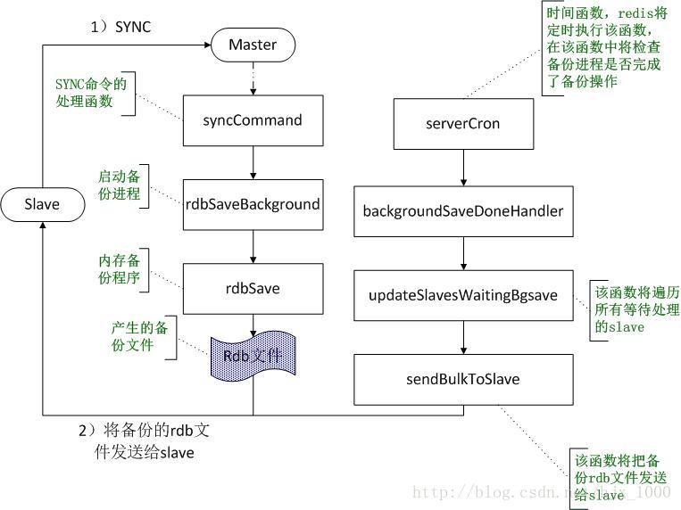
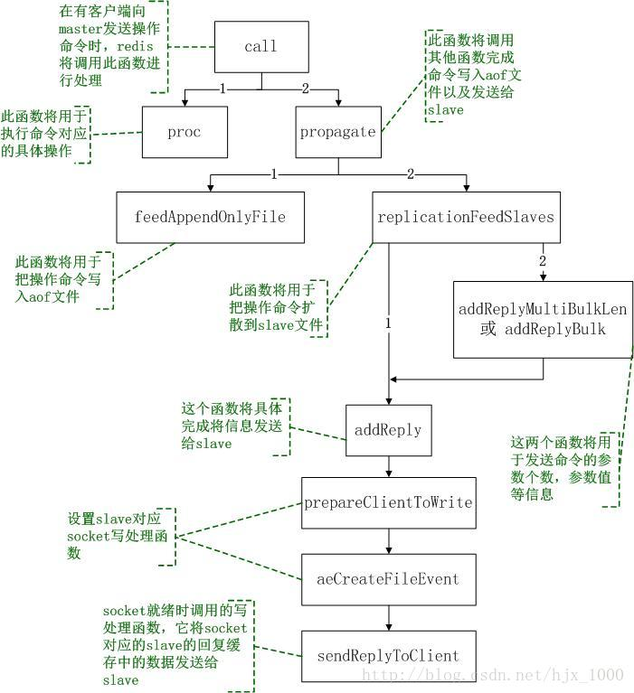

# redis-springboot

为什么redis速度快？
- redis是纯内存操作：数据存放在内存中，内存的响应时间大约是100纳秒，这是Redis每秒万亿级别访问的重要基础。
- 非阻塞I/O：Redis采用epoll作为I/O多路复用技术的实现，再加上Redis自身的事件处理模型将epoll中的连接，读写，关闭都转换为了时间，不在I/O上浪费过多的时间。
- 单线程避免了线程切换和竞态产生的消耗。
- Redis采用单线程模型，每条命令执行如果占用大量时间，会造成其他线程阻塞，对于Redis这种高性能服务是致命的，所以Redis是面向高速执行的数据库

什么是IO多路复用？

比如，现在我们模拟一个tcp服务器处理30个客户的socket，如何快速的处理掉这30个请求呢？

在不了解原理的情况下，我们类比一个实例：在课堂上让全班30个人同时做作业，做完后老师检查，30个学生的作业都检查完成才能下课。如何在有限的资源下，以最快的速度下课呢？

第一种：安排一个老师，按顺序逐个检查。先检查A，然后是B，之后是C、D。。。这中间如果有一个学生卡住，全班都会被耽误。这种模式就好比，你用循环挨个处理socket，根本不具有并发能力。这种方式只需要一个老师，但是耗时时间会比较长。

第二种：安排30个老师，每个老师检查一个学生的作业。 这种类似于为每一个socket创建一个进程或者线程处理连接。这种方式需要30个老师（最消耗资源），但是速度最快。

第三种：安排一个老师，站在讲台上，谁解答完谁举手。这时C、D举手，表示他们作业做完了，老师下去依次检查C、D的答案，然后继续回到讲台上等。此时E、A又举手，然后去处理E和A。这种方式可以在最小的资源消耗的情况下，最快的处理完任务。

第三种就是IO复用模型（Linux下的select、poll和epoll就是干这个的。将用户socket对应的fd注册进epoll，然后epoll帮你监听哪些socket上有消息到达，这样就避免了大量的无用操作。此时的socket应该采用非阻塞模式。这样，整个过程只在调用select、poll、epoll这些调用的时候才会阻塞，收发客户消息是不会阻塞的，整个进程或者线程就被充分利用起来，这就是事件驱动，所谓的reactor模式。）

## 缓存相关名词
    
### 缓存穿透
缓存层和db层都没有数据，大量无效请求进来导致缓存层和数据层都无法命中导致请求失败，高并发情况下会给持久层数据库造成很大的压力，这时候就相当于出现了缓存穿透。
- 设置无效缓存：这种方式可以解决请求的key变化不频繁的情况，如果黑客恶意攻击，每次构建不同的请求key，会导致Redis中缓存大量无效的key
- 布隆过滤器：先判断用户发来的请求的值是否存在于布隆过滤器中。不存在的话，直接返回请求参数错误信息给客户端，存在的话才会走下面的流程。

### 缓存击穿
某个热点key在某个时间突然失效，导致大量请求直接访问db层，从而导致db层压力过大而崩溃
- 设置永不失效key
- 查询串行化（加互斥锁）

### 缓存雪崩
缓存大面积失效或缓存层无法提供有效的服务，导致大量请求访问到db层，造成存储层也会挂掉的情况。
- redis集群（针对 Redis 服务不可用的情况）
- 限流，避免同时间大规模请求（针对 Redis 服务不可用的情况）
- 缓存永不失效（针对热点缓存失效的情况）
- 设置不同的失效时间比如随机设置缓存的失效时间。（针对热点缓存失效的情况）
- 缓存预热

## mysql与redis数据一致性
- 延迟双删：在写库前后都进行redis.del(key)操作，并且设定合理的超时时间。
- 异步更新缓存(基于订阅binlog的同步机制)：MySQL binlog增量订阅消费+消息队列+增量数据更新到redis，这里可以结合使用canal(阿里的一款开源框架)，通过该框架可以对MySQL的binlog进行订阅，而canal正是模仿了mysql的slave数据库的备份请求，使得Redis的数据更新达到了相同的效果。
- 删除失败问题解决：
    1. 重试
    2. 设置过期时间
    
### 延迟双删解析

#### 先更新缓存，再更新数据库
问题：更新缓存成功，更新数据库失败，导致数据不一致。

#### 先更新数据库，再更新缓存
问题：

1、A更新数据库

2、B更新数据库

3、B写入缓存

4、A写入缓存

出现数据不一致。

考虑另一种情况， 有如下两点：
1. 如果你是一个写数据库场景比较多，而读数据场景比较少的业务需求，采用这种方案就会导致，数据压根还没读到，缓存就被频繁的更新，浪费性能。
2. 如果你写入数据库的值，并不是直接写入缓存的，而是要经过一系列复杂的计算再写入缓存。那么，每次写入数据库后，都再次计算写入缓存的值，无疑是浪费性能的。显然，删除缓存更为适合。

#### 先删除缓存，再更新数据库
问题：

1、A删除缓存

2、B查询数据库获取旧值

3、B更新了缓存

4、A更新数据库

出现数据不一致的问题

##### 延时双删
```java
public void write(String key,Object data){
	redis.delKey(key);
	db.updateData(data);
	Thread.sleep(1000);
	redis.delKey(key);
}
```
问题一：延时双删，演变成了：先更新数据库，再删除缓存。。。。

比如：

1、A删除缓存

2、B查询数据库获取旧值

3、B更新了缓存

4、A更新数据库

5、A延时删缓存

1～3步执行后，数据库和缓存是一致的，相当于没删除。

4～5步：先更新数据库，再删缓存。

所以延时双删演变成了：先更新数据库，再删除缓存。问题还是没解决。。。

为什么？假设，此时，在第4步执行之前，又来了个查询C，C查询到旧值。第6步：C将旧值插入缓存。此时出现缓存和数据库不一致。

延时并不能解决：C插入缓存的操作在第5步后面执行，比如C遇到网络问题、GC问题等。当然这是小概率，但并不代表不存在。

当然，延时越长，这个问题越能规避。如果业务需求不是非常严格，是可以忽略的。

问题二：吞吐量

问题三：数据库更新后，无法保证下一次查询，从缓存获取的值和数据库是一致的。
#### 先更新数据库，再删除缓存
问题：上面C的查询，已经说明问题了。

出现数据不一致的概率，比较小。采取这个方案，取决于业务需求。

#### 终极方案
将访问操作串行化
- 先删缓存，将更新数据库的操作放进有序队列中
- 从缓存查不到的查询操作，都进入有序队列

需要解决的问题：
- 读请求积压，大量超时，导致数据库的压力：限流、熔断
- 如何避免大量请求积压：将队列水平拆分，提高并行度。
- 保证相同请求路由正确。

## 哨兵模式
Redis的哨兵(sentinel) 系统用于管理多个 Redis 服务器,该系统执行以下三个任务:
- 监控(Monitoring): 哨兵(sentinel) 会不断地检查你的Master和Slave是否运作正常。
- 提醒(Notification):当被监控的某个 Redis出现问题时, 哨兵(sentinel) 可以通过 API 向管理员或者其他应用程序发送通知。
- 自动故障迁移(Automatic failover):当一个Master不能正常工作时，哨兵(sentinel) 会开始一次自动故障迁移操作,它会将失效Master的其中一个Slave升级为新的Master, 并让失效Master的其他Slave改为复制新的Master; 当客户端试图连接失效的Master时,集群也会向客户端返回新Master的地址,使得集群可以使用Master代替失效Master。

### 原理
- 每个Sentinel以每秒钟一次的频率向它所知的Master，Slave以及其他 Sentinel 实例发送一个 PING 命令。
- 如果一个实例（instance）距离最后一次有效回复 PING 命令的时间超过 down-after-milliseconds 选项所指定的值， 则这个实例会被 Sentinel 标记为主观下线。 
- 如果一个Master被标记为主观下线，则正在监视这个Master的所有 Sentinel 要以每秒一次的频率确认Master的确进入了主观下线状态。 
- 当有足够数量的 Sentinel（大于等于配置文件指定的值）在指定的时间范围内确认Master的确进入了主观下线状态， 则Master会被标记为客观下线 。
- 在一般情况下， 每个 Sentinel 会以每 10 秒一次的频率向它已知的所有Master，Slave发送 INFO 命令 。
- 当Master被 Sentinel 标记为客观下线时，Sentinel 向下线的 Master 的所有 Slave 发送 INFO 命令的频率会从 10 秒一次改为每秒一次 。
- 若没有足够数量的 Sentinel 同意 Master 已经下线， Master 的客观下线状态就会被移除。 
- 若 Master 重新向 Sentinel 的 PING 命令返回有效回复， Master 的主观下线状态就会被移除。

### 集群原理
三个定时任务

1. 每10秒每个sentinel对master和slave执行info（发现最新的集群拓扑结构）
    - 发现slave节点
    - 确认主从关系
2. 每2秒每个sentinel通过master节点的channel交换信息(pub/sub)#channel是发布订阅的频道
    - 每个sentinel每隔2s都会向master的__sentinel__:hello这个channel中发送自己掌握的集群信息和自己的一些信息（比如host,ip,run id），这个是利用redis的pub/sub功能，每个sentinel节点都会订阅这个channel，也就是说，每个sentinel节点都可以知道别的sentinel节点掌握的集群信息，作用：信息交换，了解别的sentinel的信息和他们对于主节点的判断
3. 每1秒每个sentinel对其他sentinel和redis执行ping
    - 心跳检测,失败判定依据

### 数据同步


Redis的主从同步机制可以确保redis的master和slave之间的数据同步。按照同步内容的多少可以分为全同步和部分同步；按照同步的时机可以分为slave刚启动时的初始化同步和正常运行过程中的数据修改同步；本文将对这两种机制的流程进行分析。

全备份过程中，在slave启动时，会向其master发送一条SYNC消息，master收到slave的这条消息之后，将可能启动后台进程进行备份，备份完成之后就将备份的数据发送给slave，初始时的全同步机制是这样的：

1. slave启动后向master发送同步指令SYNC，master接收到SYNC指令之后将调用该命令的处理函数syncCommand（）进行同步处理；
2. 在函数syncCommand中，将调用函数rdbSaveBackground启动一个备份进程用于数据同步，如果已经有一个备份进程在运行了，就不会再重新启动了。
3. 备份进程将执行函数rdbSave() 完成将redis的全部数据保存为rdb文件。
4. 在redis的时间事件函数serverCron（redis的时间处理函数是指它会定时被redis进行操作的函数）中，将对备份后的数据进行处理，在serverCron函数中将会检查备份进程是否已经执行完毕，如果备份进程已经完成备份，则调用函数backgroundSaveDoneHandler完成后续处理。
5. 在函数backgroundSaveDoneHandler中，首先更新master的各种状态，例如，备份成功还是失败，备份的时间等等。然后调用函数updateSlavesWaitingBgsave，将备份的rdb数据发送给等待的slave。
6. 在函数updateSlavesWaitingBgsave中，将遍历所有的等待此次备份的slave，将备份的rdb文件发送给每一个slave。另外，这里并不是立即就把数据发送过去，而是将为每个等待的slave注册写事件，并注册写事件的响应函数sendBulkToSlave，即当slave对应的socket能够发送数据时就调用函数sendBulkToSlave（），实际发送rdb文件的操作都在函数sendBulkToSlave中完成。
7. sendBulkToSlave函数将把备份的rdb文件发送给slave。

### 数据修改操作的同步


Redis的正常部署中一般都是一个master用于写操作，若干个slave用于读操作，另外定期的数据备份操作也是单独选址一个slave完成，这样可以最大程度发挥出redis的性能。在部署完成，各master\slave程序启动之后，首先进行第一阶段初始化时的全同步操作，全同步操作完成之后，后续所有写操作都是在master上进行，所有读操作都是在slave上进行，因此用户的写操作需要及时扩散到所有的slave以便保持数据最大程度上的同步。Redis的master-slave进程在正常运行期间更新操作（包括写、删除、更改操作）的同步方式如下：
1. master接收到一条用户的操作后，将调用函数call函数来执行具体的操作函数（此过程可参考另一文档《redis命令执行流程分析》），在该函数中首先通过proc执行操作函数，然后将判断操作是否需要扩散到各slave，如果需要则调用函数propagate（）来完成此操作。
2. propagate（）函数完成将一个操作记录到aof文件中或者扩散到其他slave中；在该函数中通过调用feedAppendOnlyFile（）将操作记录到aof中，通过调用replicationFeedSlaves（）将操作扩散到各slave中。
3. 函数feedAppendOnlyFile（）中主要保存操作到aof文件，在该函数中首先将操作转换成redis内部的协议格式，并以字符串的形式存储，然后将字符串存储的操作追加到aof文件后。
4. 函数replicationFeedSlaves（）主要将操作扩散到每一个slave中；在该函数中将遍历自己下面挂的每一个slave，以此对每个slave进行如下两步的处理：将slave的数据库切换到本操作所对应的数据库（如果slave的数据库id与当前操作的数据id不一致时才进行此操作）；将命令和参数按照redis的协议格式写入到slave的回复缓存中。写入切换数据库的命令时将调用addReply，写入命令和参数时将调用addReplyMultiBulkLen和addReplyBulk，函数addReplyMultiBulkLen和addReplyBulk最终也将调用函数addReply。
5. 在函数addReply中将调用prepareClientToWrite（）设置slave的socket写入事件处理函数sendReplyToClient（通过函数aeCreateFileEvent进行设置），这样一旦slave对应的socket发送缓存中有空间写入数据，即调用sendReplyToClient进行处理。
6. 函数sendReplyToClient（）的主要功能是将slave中要发送的数据通过socket发出去。

### 心跳检测
心跳检测发生在命令传播阶段，从节点默认每秒发送一次心跳检测命令 REPLCONF ACK <偏移量> 获取主节点心跳。

发送该命令主要为了：检测主从服务器的网络连接状态、辅助实现min-slave选项、检测命令是否丢失。


## 通过Docker配置Redis集群

### 拉取redis镜像
```shell
docker pull redis
```

### 创建redis容器
```shell
docker run -d -p 6379:6379 --name redis-node1 --restart always --privileged=true redis --appendonly yes
docker run -d -p 6380:6379 --name redis-node2 --restart always --privileged=true redis --appendonly yes
docker run -d -p 6381:6379 --name redis-node2 --restart always --privileged=true redis --appendonly yes
```


```
    -p 6380:6380 端口映射：前表示主机部分，：后表示容器部分。
    --name redis1  指定该容器名称，查看和进行操作都比较方便。
    –restart always: 开机启动
    –privileged=true: 提升容器内权限
    -v 挂载目录，规则与端口映射相同。
    为什么需要挂载目录：个人认为docker是个沙箱隔离级别的容器，这个是它的特点及安全机制，不能随便访问外部（主机）资源目录，所以需要这个挂载目录机制。
    -d redis 表示后台启动redis
    redis-server /etc/redis/redis.conf  以配置文件启动redis，加载容器内的conf文件，最终找到的是挂载的目录/usr/local/docker/redis.conf
    --appendonly yes  开启redis 持久化
```

### 使用docker命令查看容器ip地址
```shell
docker inspect redis-node1 redis-node2 redis-node3 | grep IPAddress
        "SecondaryIPAddresses": null,
        "IPAddress": "172.17.0.5",
                "IPAddress": "172.17.0.5",
        "SecondaryIPAddresses": null,
        "IPAddress": "172.17.0.6",
                "IPAddress": "172.17.0.6",
        "SecondaryIPAddresses": null,
        "IPAddress": "172.17.0.7",
                "IPAddress": "172.17.0.7",

```
### 进入从节点redis容器,并设置自己的主节点
```shell
docker exec -it redis-node2 redis-cli
127.0.0.1:6379> SLAVEOF 172.17.0.5 6379
OK
exit
docker exec -it redis-node2 redis-cli
127.0.0.1:6379> SLAVEOF 172.17.0.5 6379
OK
exit
```

### 进入主节点查看从节点信息
```shell
docker exec -it redis redis-cli
info replication    # 查看redis信息
# Replication
role:master
connected_slaves:3
slave1:ip=172.17.0.6,port=6379,state=online,offset=864,lag=0
slave2:ip=172.17.0.7,port=6379,state=online,offset=864,lag=1
master_replid:d6b6117c6cafe96c591add499ca4760a15d0ff59
master_replid2:3680558217926f7fe4d0b7e963b3fe0f166f65b9
master_repl_offset:864
second_repl_offset:197
repl_backlog_active:1
repl_backlog_size:1048576
repl_backlog_first_byte_offset:1
repl_backlog_histlen:864
127.0.0.1:6379>
```

### 其他
方法1：认谁当爹（命令）
```shell
SLAVEOF IP PORT

SLAVEOF NO ONE
```

方法2：认谁当儿子（命令）
```shell
CLUSTER MEET IP PORT
# redis.conf需要开启cluster-enabled yes
```

方法3：配置文件配置
```shell
replicaof <masterip> <masterport>
```

### redis事务
- MULTI：用于标记事务块的开始。Redis会将后续的命令逐个放入队列中，然后才能使用EXEC命令原子化地执行这个命令序列。
- EXEC：执行所有事务块内的命令。
- DISCARD：取消事务，放弃执行事务块内的所有命令。
- WATCH：监视一个(或多个) key ，如果在事务执行之前这个(或这些) key 被其他命令所改动，那么事务将被打断。
- UNWATCH：取消 WATCH 命令对所有 key 的监视。
     
### 分布式锁
可靠的分布式锁具有如下特点：
- 互斥性：在任意时刻，只有一个客户端能持有锁
- 不会发生死锁：即使有一个客户端在持有锁的期间崩溃而没有主动解锁，也能保证后续其他客户端能加锁
- 具有容错性：只有大部分的redis节点正常运行，客户端就可以加锁和解锁
- 解铃还须系铃人：加锁和解锁必须是同一个客户端，客户端自己不能把别人加的锁解了
- 锁不能自己失效：正常执行程序过程中，锁不能因为某个原因失效
#### setnx
redis setnx命令: SET if Not eXists） 命令在指定的 key 不存在时，为 key 设置指定的值。
RedisTemplate.opsForValus().setIfAbsent()

存在问题：
1. 加锁后业务逻辑异常，无法释放锁
    - 添加过期时间
2. 业务时间过长，导致锁过期失效
    - 加长过期时间
    - 在主线程外新开一个线程，用来重置过期时间，线程结束后释放锁
3. 业务时间过长，导致业务执行过程中锁失效，另一个请求进来后获得锁。这时候第一次请求结束，释放锁导致第二次请求的锁被释放
    - 幂等性判断

#### Redisson（可重入锁）
通过lua脚本保持原子性

加锁请求：key是否存在，若存在。检查value是否匹配，匹配判断是个重入锁，锁的次数+1并设置失效时间，最后返回null结束。若value不匹配，说明锁被其他线程占用，返回锁的剩余使用时间。

若key不存在，则执行加锁（UUID + threadId），设置重入次数为1，并设置失效时间，返回null结束。

解锁：先判断key是否存在，再判断value是否一样。如果一样，重入锁次数-1，如果重入锁次数大于0，重新设置过期时间，返回0结束。如果小于等于0，删除key，然后广播释放锁消息

如果key不存在，广播释放锁消息，返回1结束。

存在问题：
1. redisson集群，主节点加锁成功后，会同步数据。当在同步之前，主节点挂了，这时候锁丢失
   - RedissonRedLock

#### RedissonRedLock：解决集群同步时锁丢失问题
最核心的变化就是需要构建多个 RLock ,然后根据多个 RLock 构建成一个 RedissonRedLock，因为 redLock 算法是建立在多个互相独立的 Redis 环境之上的（为了区分可以叫为 Redission node），Redission node 节点既可以是单机模式(single)，也可以是主从模式(master/salve)，哨兵模式(sentinal)，或者集群模式(cluster)。这就意味着，不能跟以往这样只搭建 1个 cluster、或 1个 sentinel 集群，或是1套主从架构就了事了，需要为 RedissonRedLock 额外搭建多几套独立的 Redission 节点。 比如可以搭建3个 或者5个 Redission节点，具体可看视资源及业务情况而定。

#### Zookeeper(临时有序节点)
错误例子：程序通过创建zookeeper的临时节点，来获取和释放锁。但是当多个进程监听同一个锁时候，会造成zookeeper压力过大，导致服务崩溃（羊群效应、惊群效应 ）

正确案例：使用zookeeper的临时有序节点。假设ABCD分别创建临时有序节点A(0001), B(0002), C(0003), D(0004),节点最小的获取锁。此时B监听A，C监听B，D监听C。

当A释放锁后删除临时节点。此时B监听到了A删除了节点，就会判断当前自己节点是否为最小节点。如果是，就获得锁，如果不是就继续等待。

#### mysql实现分布式锁
要实现分布式锁，最简单的方式可能就是直接创建一张锁表，然后通过操作该表中的数据来实现了。当我们想要获得锁的时候，就可以在该表中增加一条记录，想要释放锁的时候就删除这条记录。
1. 这种锁没有失效时间，一旦释放锁的操作失败就会导致锁记录一直在数据库中，其它线程无法获得锁。这个缺陷也很好解决，比如可以做一个定时任务去定时清理。
2. 这种锁的可靠性依赖于数据库。建议设置备库，避免单点，进一步提高可靠性。
3. 这种锁是非阻塞的，因为插入数据失败之后会直接报错，想要获得锁就需要再次操作。如果需要阻塞式的，可以弄个for循环、while循环之类的，直至INSERT成功再返回。
4. 这种锁也是非可重入的，因为同一个线程在没有释放锁之前无法再次获得锁，因为数据库中已经存在同一份记录了。想要实现可重入锁，可以在数据库中添加一些字段，比如获得锁的主机信息、线程信息等，那么在再次获得锁的时候可以先查询数据，如果当前的主机信息和线程信息等能被查到的话，可以直接把锁分配给它。


